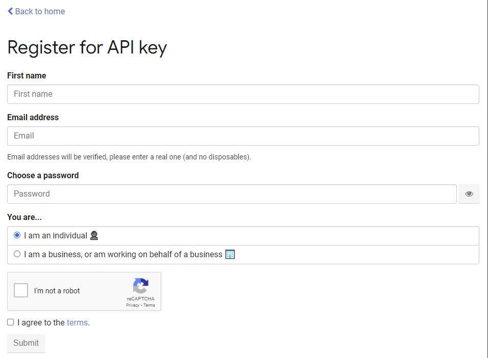

# Ionic Weather and News App
An Ionic application which displays local weather information from the [openweathermap.org](https://openweathermap.org/) API and local news articles from the [newsapi.org](https://newsapi.org/) API.

## About
The application has a main page which displays local weather information and local news articles based on a location configured by the user.

## Usage

### 0. Note on usage of weather and news APIs

Weather and News API keys for the [openweathermap.org](https://openweathermap.org/) API and [newsapi.org](https://newsapi.org/) API are required for this project to work.

#### openweathermap.org API

An appropriate API key for this service can be obtained by visiting [openweathermap.org/api](https://openweathermap.org/api) and subscribing to _Current Weather Data_. You will then get the option to select a _Free_ API key.


#### newsapi.org API

An appropriate API key for this service can be obtained by visiting [newsapi.org](https://newsapi.org/) and clicking _Get API Key_. The user is then taken to a page where they can register for an API key.



API keys must be stored in an _env.js_ file in the _src_ directory of the project. The _env.sample.js_ file included shows how to enter both API keys:

```javascript
const WEATHER_API_KEY = 'OpenWeatherMap.OrgApiKeyGoesHere';
const NEWS_API_KEY ='newsApi.OrgApiKeyGoesHere';
```

The `OpenWeatherMap.OrgApiKeyGoesHere` and `newsApi.OrgApiKeyGoesHere` strings should be replaced with strings including your API keys for the two services.

### 1. Startup

When a user opens the app in a browser, they will arrive on the `Home` page of the application.


As no location has been configured, the message "City not found" is displayed under the "Weather for" heading and no weather information is displayed in the list below it on the page. The _NEWS_ button is also disabled, preventing a user from trying to load news articles without first configuring a location.

### 2. Settings

Clicking or tapping the settings icon on the top-right of the page will open the `Settings` page.


The user can tap in the _City_ input element and enter the name of a city for which weather and news should be loaded. The user can also select a unit system in the radio group below. The default unit system is _Metric_. Tapping _SAVE_ will now save the settings entered by the user, and a _Toast_ will appear at the top of the screen confirming that the settings have been saved.


Tapping the _SAVE_ button without entering a city will automatically populate the _City_ field with the city, 'Galway'. The settings will be saved with 'Galway' set as the city.

Returning to the `Home` page without setting a city will not load any information, meaning there is still no weather information available and the _NEWS_ button remains disabled.

### 3. Populated Weather and News Sections

Returning to the `Home` page after entering a valid city will load the appropriate weather information for that city from the [openweathermap.org](https://openweathermap.org/) API.


<!-- <p float="left">
    
    
</p> -->

The _NEWS_ button will also now be active. Tapping it will display the top 5 news articles in the country local to the user's selected city from the [newsapi.org](https://newsapi.org/) API. These articles are displayed in a list below the _NEWS_ button. Each item in the list can be clicked / tapped to open the url for that news article. The total number of news articles available in the selected country is displayed above the news articles.


### 4. Invalid Configuration

If the name of a city which is not known to the [openweathermap.org](https://openweathermap.org/) API is entered into the _City_ field on the `Settings` page, no weather data and no news data will be loaded and the _NEWS_ button on the `Home` page will return to its disabled state.


A _Toast_ is also shown at the top of the page, explaining that no valid city could be found in the user's settings.

### Compatibility & Software Versions
Built using
> Ionic CLI v5.4.4
> Ionic Framework: ionic-angular 3.9.9

## Contact
### Barry Sheehan
* Home page: [BarrySheehan.com](http://www.barrysheehan.com)
* Twitter: [@barrymsheehan](https://twitter.com/barrymsheehan)

## License
This project is licensed under the GNU General Public License v3.0 - see the [LICENSE.md](LICENSE.md) file for details.
